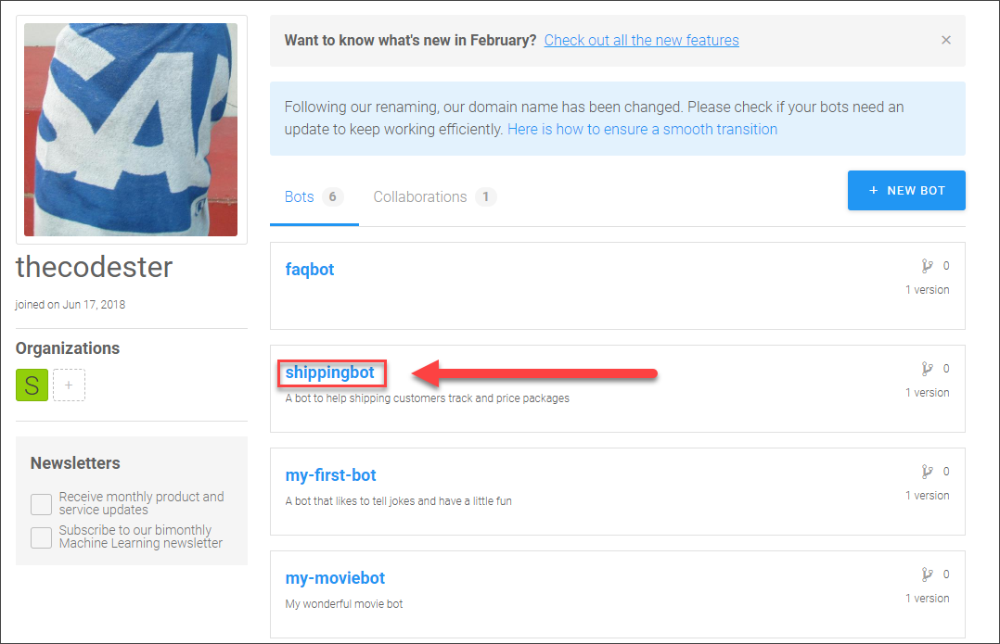
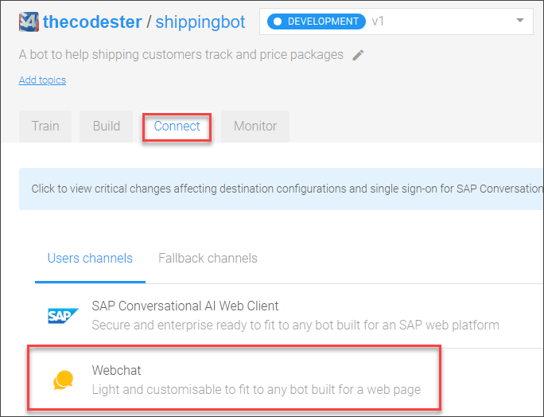
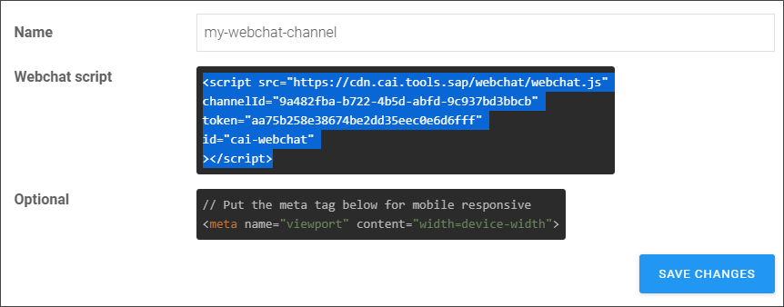
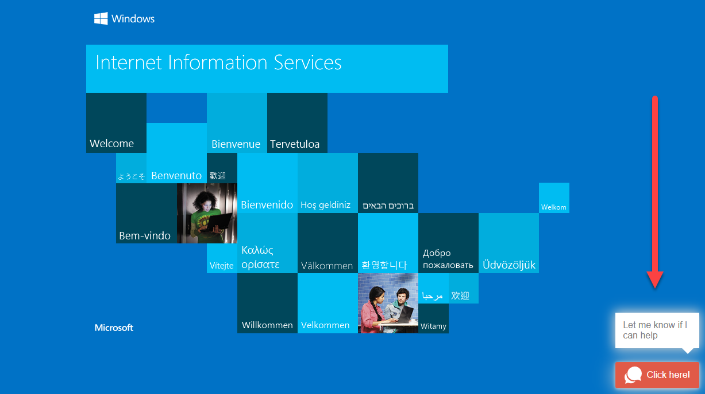
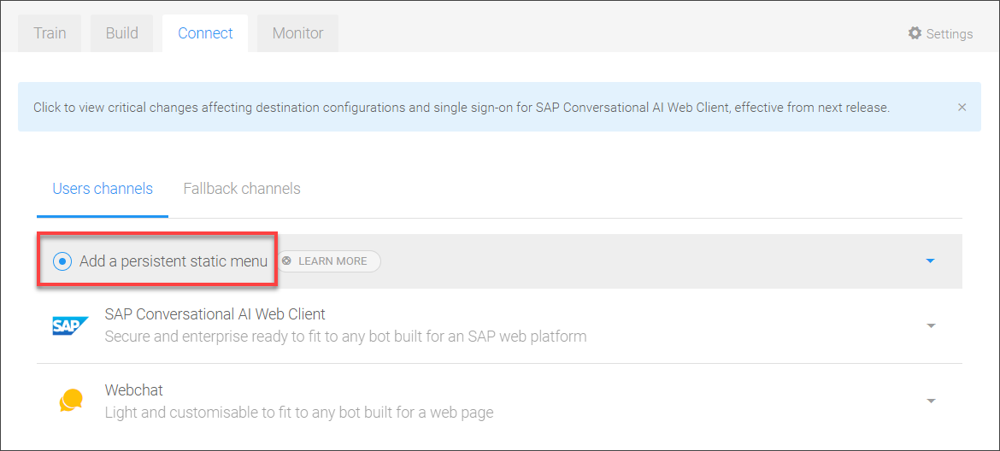
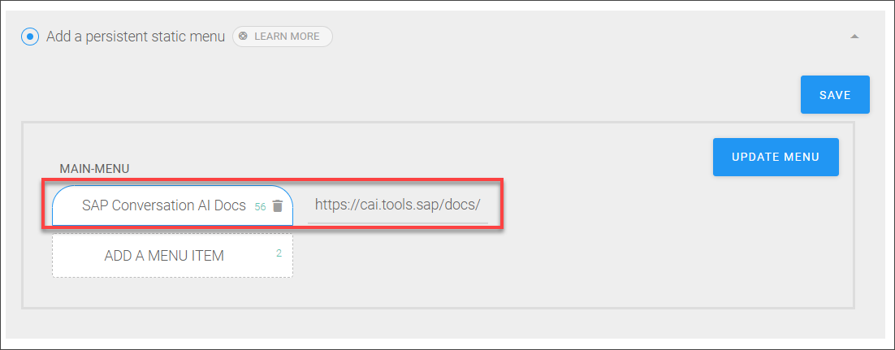
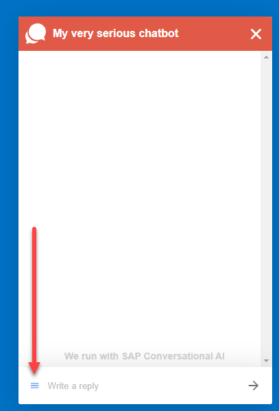

# Deploy an SAP Conversational AI Chatbot on a Web Site
<!-- description --> Deploy an SAP Conversational AI chatbot on a web site and control the look and feel.

## Prerequisites
 - You have build a chatbot. You can use one of the following tutorials:
 - [Build Your First Chatbot with SAP Conversational AI](cai-bot-getting-started)
 - [Build Your First FAQ Chatbot](conversational-ai-faq-chatbot-beginner)
 - [Create Chatbot for Customers of Shipping Company](group.cai-shipping-bot)

## You will learn
  - How to add a chat bot to a web site

---

### Open your project

Go to [SAP Conversational AI](https://cai.tools.sap/signup), sign in, and open the project for the bot you want to deploy.

For example:

### Get web code

1. Go to the **Connect | Users Channels | Webchat**.

    

2. Click **Webchat**.

3. Change the settings as you want, for example, change the color for the chatbot's replies to light green.

    

4. Scroll down and click **Create** and copy the JavaScript code for your HTML page.

    

5. Click **Save Changes**.

### Add code to web site

Add the code to your web site.

For example, enable Microsoft IIS web server, and edit the `iisstart.html` file by adding the script code.

If you now open the default page, you will the chatbot at the bottom right, with the texts you defined.

If you start to chat, you can see that the chatbot's replies are in light green.

### Add menu

You can also add a static menu to the bot, so users will always have a set of links in case they need, for example, to check the documentation or reach out to support.

1. Go to the **Connect | Users Channels | Webchat**.

2. Choose **Add a persistent static menu**.

    

3. Click **Add A Menu Item**, then **Link**, and then enter:

    |  :------------- | :-------------
    |  Button title   | **`SAP Conversation AI Docs`**
    |  URL           | **`https://cai.tools.sap/docs/`**

    

4. Click **Save**.

>You can add a menu of links, nested menus, and buttons so users can add standard responses into the chat.

Go back to your web page with your chatbot, and you will now see a hamburger menu.

Click on the icon and you will see the menu.

### Test yourself

---
