# Manage Your Chatbot with Versions and Environments
<!-- description --> Create versions and environments for your SAP Conversational AI chatbot to make it easier to manage the development process.

## Prerequisites
 - You have already built the bot described in [Create Chatbot for Customers of Shipping Company](group.cai-shipping-bot).

## You will learn
  - The value of versions and environments in the chatbot building process
  - How to create a version
  - How to create an environments, and manage the version of an environment
  - How to push your chatbot into production


## Intro
In this tutorial, you'll create a second version of the shipping bot you created in [Create Chatbot for Customers of Shipping Company](group.cai-shipping-bot).

You will then create 2 environments -- development and production -- and take the new version of the bot and deploy it to production, without needing to deploy anything on your landscape (like updating the web page).

---

### What are versions?


A version is a copy of your bot's training dataset and skills. Each version is independent of the others and can be managed individually. For example, you might want to create a new version prior to major updates to your training dataset or skills. Or you might want to create two or more variants of the same core bot for different audiences.

When you create a new bot, by default, your bot has only one main version, called **v1**.

> **A new version** lets you create a copy of all your intents, entities and skills in the same bot as another development version or for a different purpose. The versions share some settings.

>**Forking** a bot lets you copy a bot into a separate bot project, and the 2 copies are afterward completely separate and independent.

Note that when you make additional versions, copies of the **Train** and **Build** tabs are created. The **Connect** and **Monitor** tabs, and settings are shared among the versions.


### What are environments?


Your bot's environments represent a way to manage the development of the bot. Typically, you create environments for **Development**, **Testing** and **Production**, and then decide which version of the bot you want in each of the environments.

Since bots are deployed via channels, each channel is assigned an environment (i.e., each channel for your bot could be for development, testing or production). The version of the bot assigned to that environment is the one users will see on that channel.


>For example, you can have a development web site and a production web site, and create 2 Webchat channels, assigning one channel the **Development** environment and the other the **Production** environment. You then take the JavaScript code for the development channel and put on your development website, and the code for the production channel on the production website.

> When you develop a new version that you now want to push to production, you just assign that version to the **Production** environment, and automatically users on production website will see the new version of the bot.

When you first create a bot, you automatically have the **Development** environment (which is the default environment), with version v1 assigned to it.

#### System Aliases

When you create a chatbot, you often want to bring backend data into the bot in response to something the user said. You do this through API calls in a skill, each requiring a URL.

Instead of providing the entire URL in each API call, you can define a base URL for all API calls, one for each version of your bot.

And instead of providing a single base URL per version, you can use system aliases, and define multiple base URLs and then assign different values for each of these base URLs in each environment. The benefits are:

-  You can define more than one base URL for different backend systems.

    

- You can assign different values for a base URL in different environments, for example a development backend for the bot in the development environment, and a production backend for the production bot.

    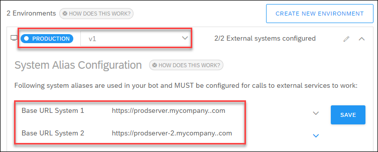


### Create version 2 of the shipping bot


Now you will create a second version of the shipping bot.

1. Open your shipping bot.

2. At the top of the page, open the version dropdown list and click **Create Version**.

    

    In the popup, enter or select the following values:

    - **Your version name**: `v2`

    - **From which version?**: `v1`

    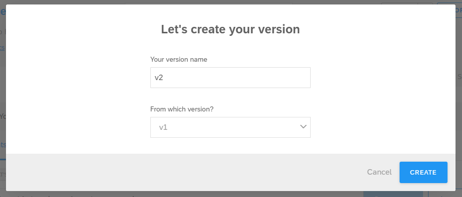

3. Refresh the page and again open the version dropdown list. You will see the new version, which is identical to the original version.

    


### Make change in version 2 of the shipping bot

Now, you will make a change in version 2, which represents for this tutorial a development version where you are working on new features now yet ready to be deployed.

1. In the version dropdown, select `v2`.

2. Go to **Build > greetings**.

3. In the **Actions** tab, find the message group where the **greetings** intent must be present.

    Click **Send Message**.

    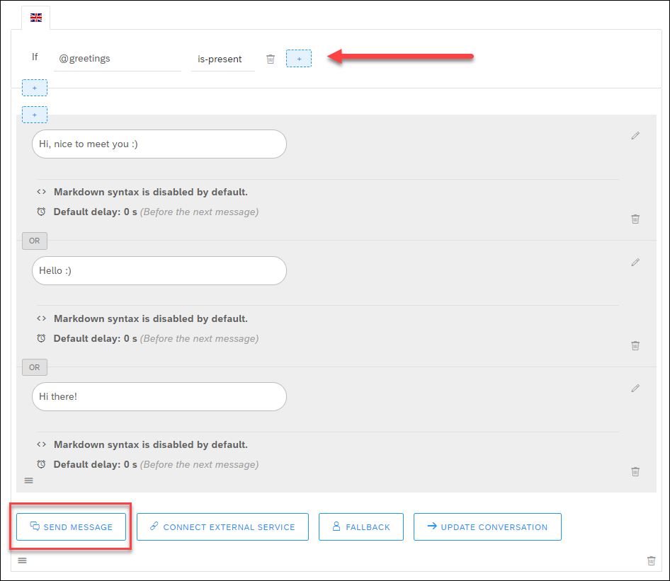

4. Select **Image**, and add the following URL for the image:

    ```URL
    https://images.unsplash.com/photo-1596443686812-2f45229eebc3
    ```

    Click **Save**.

    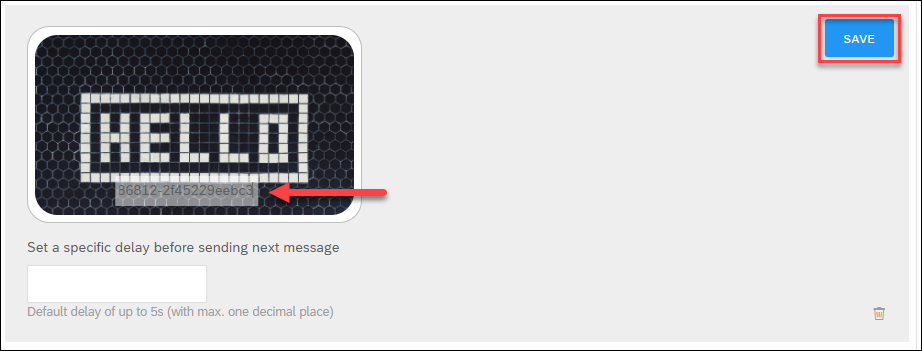


### Test the 2 versions


Since you are still in version 2, test that first. Go to the Chat Preview and enter **Hi**.

You get the image.

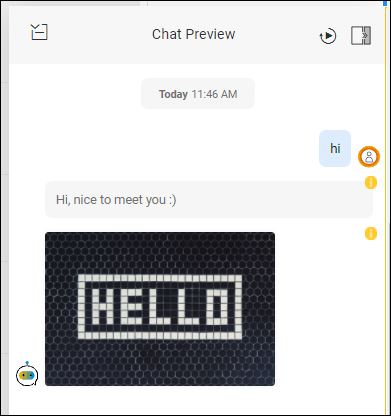

At the top, change the version to `v1`. Now enter **Hi** again, and you get just the text greeting.

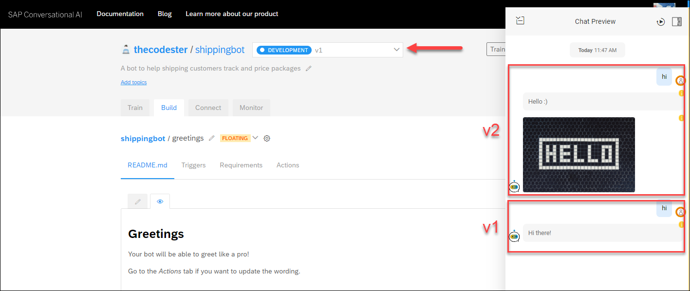

You now have 2 versions, the original and a new one with our experimental feature. In the next steps, you'll use environments to manage your development so you can push your development features into production.


### Create new environment


You now will create a new environment called **Production**, so that when you have a new version that is tested you can easily move it to production -- without having to mess with your channel configuration.

1. Go to **Settings**.

    

2. Click **Environments**, and then click **Create Environment**.

    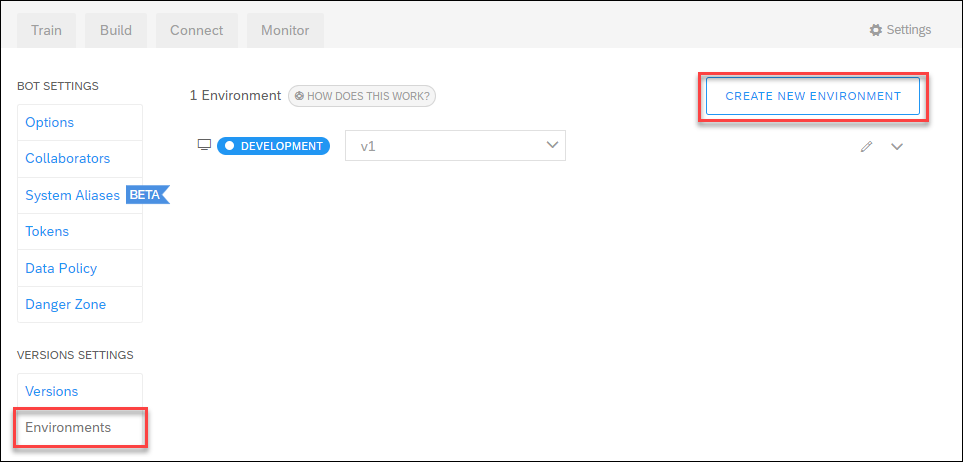

    In the popup, enter or select the following values:

    - **Your environment name**: `Production`

    - **Which version should be deployed?**: `v1`

    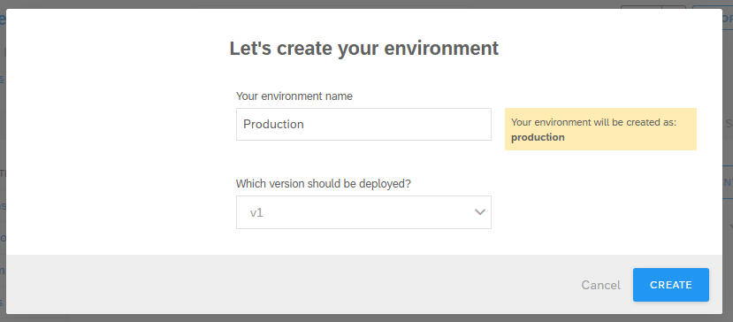

    You make **v1** the production version, and you will change **v2** -- with the new feature -- as the development version.

3. On the environment screen (you should be there after creating a new environment), select the version dropdown for the **Development** environment and set it to **v2**.

    In the popup, click **Deploy v2**.

    


### Deploy Webchat with environment


As an example of how to use the environment, you will deploy the production environment (version v1, without the image) via a Webchat channel.

Later, you will see how to quickly elevate v2 to production from development.

1. In the **Connect** tab, go to the **Webchat** channel and click the plus sign ( **+** ) to start to create a new channel.

    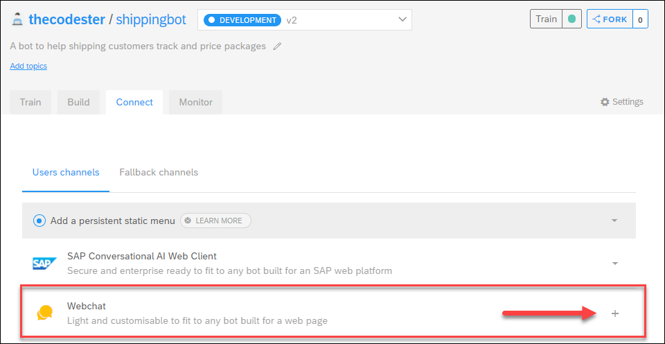

    Keep all the settings and click **Create**.

    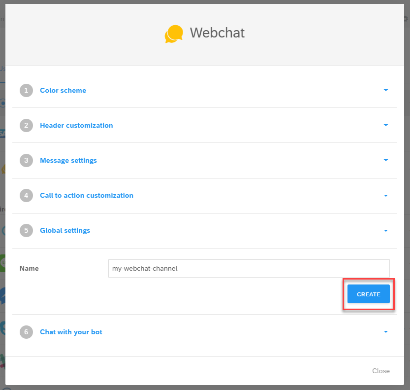

2. Copy the JavaScript.

    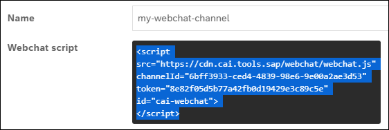

    Click **Close**.

3. Expand the **Webchat** channel.

    

    Next to the channel you just created, set the environment dropdown to `Production`.

    

>If you do not set an environment for the channel, the default environment is used.

>The default environment is set within the bot's settings:

>    - When a bot is created, there is one environment called **Development** and it is set as the default.

>    - You can see which is the default because it is the first environment listed, in the example, **Testing**.

>     

>    - If you want to set a different environment as the default, expand it (arrow to the right) and check the **Defaults** checkbox.

>     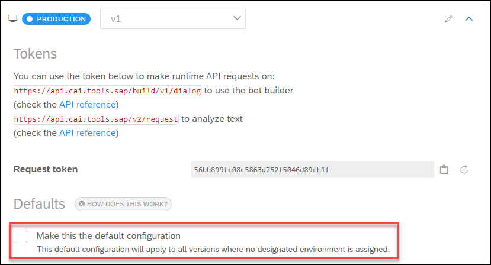

>     You cannot uncheck the **Defaults** checkbox, nor can you delete the default environment.


### Deploy bot on web page


Create a web page.

>You can simply create a file called `index.html` and copy in the following text.

>
```HTML
<html>
  <head>
    <title>Bot Tester</title>
  </head>
  <body>
    <div>
      <h1> Bot Tester</h1>
    </div>
  </body>
</html>
```

In the `<body>` section after the `<div>` tag, copy in the `<script>` section you copied in the previous step, so it looks something like this:

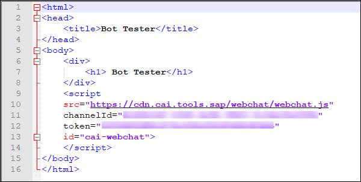

Open the page, and then open in the bottom right the bot, and enter **hi**. The bot is v1, the one without the image.

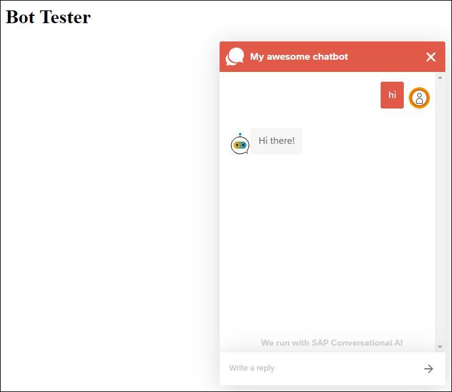


### Upgrade version 2 to production


Now you will simulate that development is complete and you want to push the new version to production.

1. Go to **Settings** for the bot, and click **Environments**.

2. Next to the **Production** environment, select `v2`.

    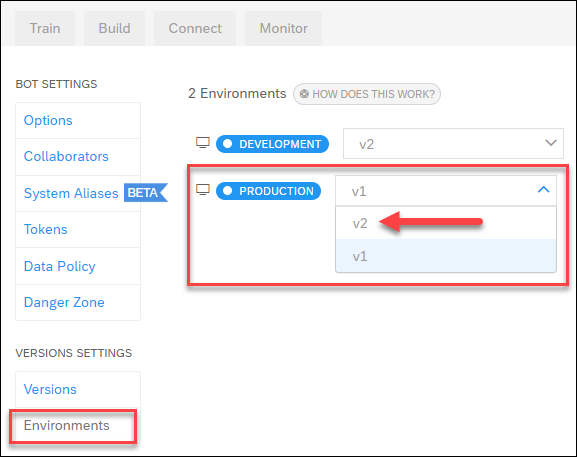

    In the popup, click **Deploy v2**.

3. Go back to your web page and enter **hi** again. Now you get version v2, with the picture.

    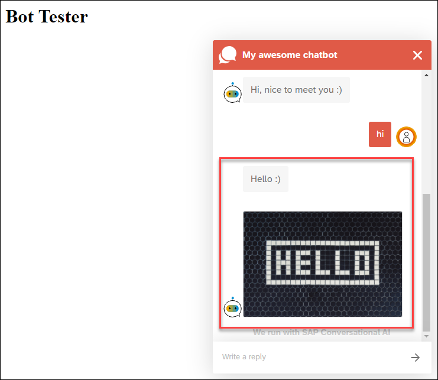


### Test yourself


---
